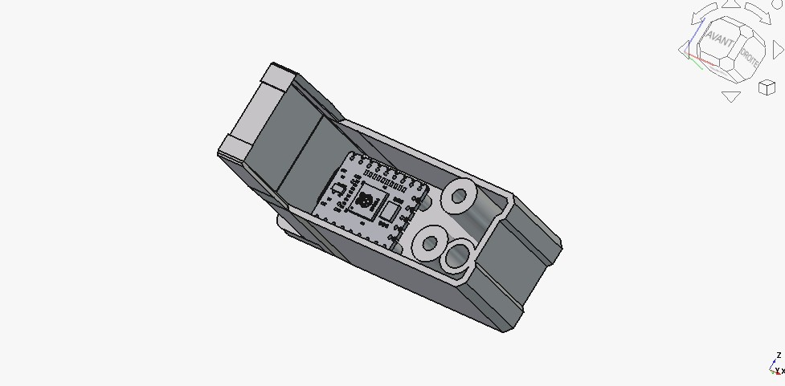
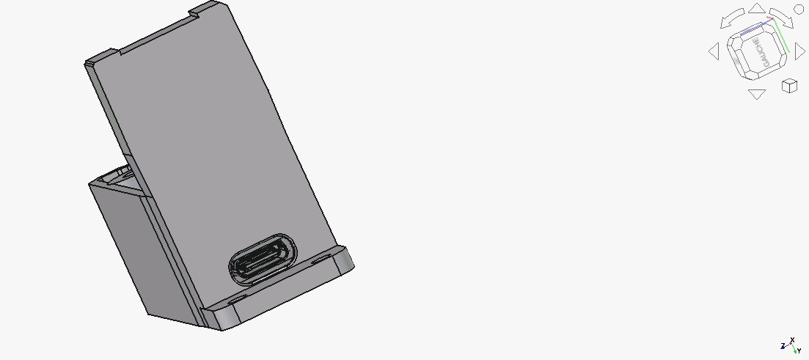

# 05 — The printed receptacle

A **one‑piece receptacle** that holds the **SFS 2.0** and the **RP2040‑Zero** together
and mounts to a **2020 extrusion** — so the whole sensor module is a single printed
part with one USB cable leaving it.

- **Print file:** [`cad/SFS_Support_2020.stl`](../cad/SFS_Support_2020.stl)
  — binary STL, **59 488 facets**, **watertight** (verified: 0 open/non‑manifold
  edges, edges = 1.5 × facets exactly), volume ≈ 13.7 cm³.
- Bounding box: **69.3 mm** (incl. the 2020 tab) × **47.5 mm** × **24.7 mm**.
- **Source:** [`cad/SFS20_Support_V4.FCStd`](../cad/SFS20_Support_V4.FCStd)
  — ⚠️ **direct BREP modelling, not a parametric feature tree**: there are no
  dimensions to edit in a tree. Provided for those who want to adjust the geometry
  by direct modelling.

> Design note: the part was modelled face by face against the real SFS/RP2040 STEP
> geometry (an earlier patch‑on‑patch attempt was scrapped and rebuilt from scratch).

## Features

- **RP2040‑Zero cavity** at the −X end, USB‑C exposed through an opening cut to the
  **real connector contour** (obround; the tight axis is the ~3.4 mm connector
  height — see *Known‑open items* below).
- **2× M6 filament ports** matching the SFS bore, for the PC4‑M6 fittings.
  → Run the **PTFE ID2/OD4** guide all the way into the SFS bore on both
  (see [docs/01](01-hardware.md)).
- **2× M3 mounting tunnels** through the SFS mount face — Ø3.4 clearance shaft with a
  **flat Ø6 counterbore** for M3×12 button‑head screws (button head = flat‑bottom
  counterbore, never a conical countersink), ~6 mm thread engagement into the SFS.
- **2× BOOT/RESET access holes**, **ovalised 3.0 × 5.0 mm**, aligned to the Pico's
  KEY1/KEY2 buttons.
- **4× PCB standoffs**, trimmed to seat exactly on the board's top face
  (**Y = 56.60 mm + 0.10 mm clearance**) — no bottoming‑out on the PCB.
- **Reinforced outer wall ≈ 3.45 mm** for rigidity.
- **2020 mounting tab** on the −X face: extended +20 mm in X, **2× M3 through‑holes**
  for T‑nut mounting to the extrusion.
- Front mouth aligned to a single plane with a small **R0.3 fillet** on the front
  contour edges.

## Suggested print settings

This is a functional structural bracket, so print it strong:

| Setting | Value |
|---------|-------|
| Material | **ABS or ASA** (matches the toolhead environment; PETG works too) |
| Layer height | 0.2 mm |
| Walls / perimeters | **4** (wall count is the real strength lever, not layer height) |
| Infill | 30–40 % |
| Supports | Only where the USB‑C / port / button openings overhang, depending on orientation |

> Orientation is not prescriptive — pick the face that puts the mounting tab and the
> filament ports on clean surfaces and minimises support inside the pico cavity.

## Assembly

- Seat the RP2040‑Zero in its cavity (USB‑C through the end‑wall opening) and
  **hot‑glue it at the four corners** — that's the designed retention: simple, holds
  firmly, and stays serviceable (hot glue peels off if you ever need the board out).
- Screw the receptacle to the SFS mounting face with the 2× M3×12 button‑heads, and
  to the 2020 extrusion through the tab with M3 + T‑nuts.
- Run the PTFE ID2/OD4 guides into the SFS bore on **both** ports (see
  [docs/01](01-hardware.md)).

## Known‑open items / optional refinements

The part is **functional** (the author: *"it's not perfect"* — but it does the job);
a few optional refinements were deliberately left open:

- **Positive pico retention** — the cavity is open by design; hot glue at the four
  corners is the intended fix (see *Assembly*). Add a clip/lid in the source if you
  want a mechanical retention instead.
- **USB‑C opening clearance** — the truly tight axis is the **connector height**
  (~3.4 mm opening vs ~3.16 mm connector, ≈0.2 mm play); the long axis is already
  ~2× the connector width. If your cable's overmold binds, open the *height* axis
  slightly in the source (an earlier tweak widened the long axis, which changes
  nothing — see `CHANGELOG.md`, 07‑04).
- **−Y mouth flush lip** — a ~0.01 mm residual skin (1/20 of a layer, not sliced) was
  left because OCC refused a perfectly coincident cut; reconstruct the −Y face as a
  separate parametric frame if you want a geometric flush.
- Minor plane‑alignment nits (floor/ceiling ±10.728 vs ±10.7) — cosmetic.

## ⚠️ Maintainer note — regenerating the STL
When rebuilding/exporting from the source: **always re‑read the exported file on disk**
(facet count / size / date) to prove the content before printing — do not trust the
"export succeeded" message alone (a stale STL once got printed for 1h40 this way).
If exporting from a snap‑packaged FreeCAD, note the export lands in the snap sandbox
(`~/snap/freecad/<rev>/…`), not your real home.
